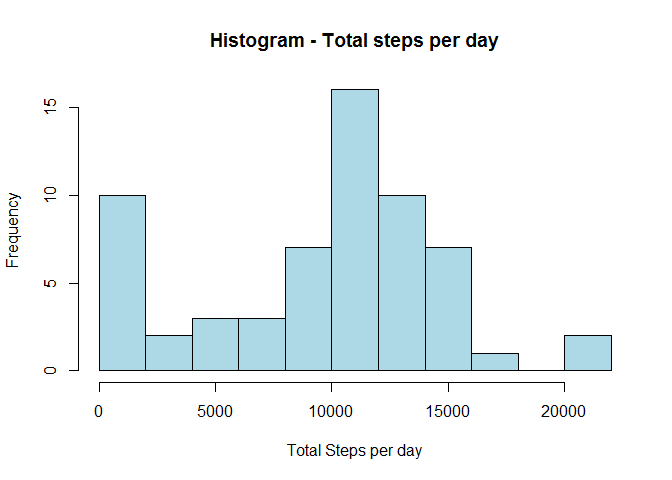
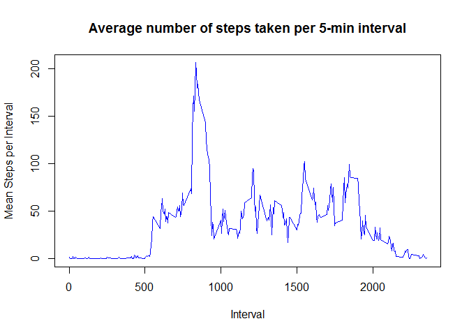
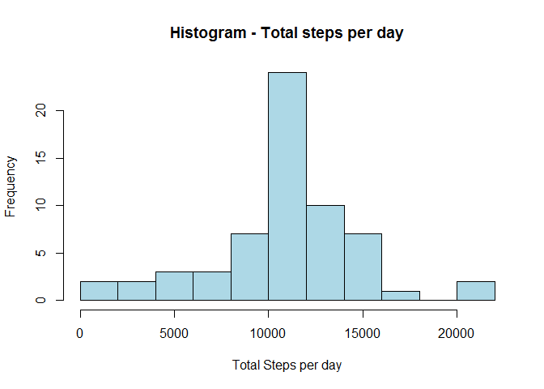
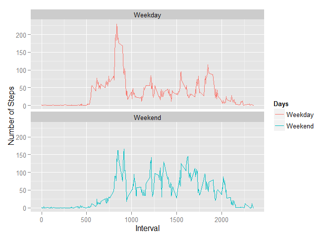

# Reproducible Research: Peer Assessment 1

# ------------------------------------------------------------------------------------------


## Loading and preprocessing the data

```r
library(ggplot2)

activityData <- read.csv("activity.csv", header=TRUE, stringsAsFactors=FALSE)
activityData$steps <- as.numeric(activityData$steps)
activityData$date <- as.Date(activityData$date)
activityData$interval <- as.numeric(activityData$interval)
```

## What is mean total number of steps taken per day?

```r
dailySteps <- aggregate(activityData$steps, 
                        list(day=activityData$date), 
                        sum, na.rm=TRUE)
colnames(dailySteps) <- c("Day", "Steps")

hist(dailySteps$Steps, col="lightblue", 
     xlab="Total Steps per day", 
     main = "Histogram - Total steps per day", breaks=15)
```

 

```r
meanSteps <- as.character(round(mean(dailySteps$Steps)))
medianSteps <- as.character(median(dailySteps$Steps))
```

####The mean steps taken in a day   :  9354

####The median steps taken in a day :  10395

## What is the average daily activity pattern?


```r
intervalSteps <- aggregate(activityData$steps, 
                           list(interval=activityData$interval), 
                           mean, na.rm=TRUE)

colnames(intervalSteps) <- c("Interval", "Steps")
plot(intervalSteps$Interval, intervalSteps$Steps, 
     type = "l", col="blue", 
     xlab = "Interval", ylab = "Mean Steps per Interval", 
     main="Average number of steps taken per 5-min interval")
```

 

```r
maxIndex <- which.max(intervalSteps$Steps)
maxInterval <- intervalSteps$Interval[maxIndex]
```


####The Maximum steps are taken for the interval:  835

## Imputing missing values


```r
missingIndex <- is.na(activityData$steps)
numMissingValues <- sum(missingIndex)
```
####The total number of missing rows are: 2304

```r
imputedData <- activityData
for (i in which(is.na(activityData$steps))) {
        imputedData$steps[i] <- intervalSteps$Steps[which(intervalSteps$Interval == imputedData$interval[i])]
}

imputedDailySteps <- aggregate(imputedData$steps, 
                        list(day=imputedData$date), 
                        sum, na.rm=TRUE)
colnames(imputedDailySteps) <- c("Day", "Steps")

hist(imputedDailySteps$Steps, col="lightblue", 
     xlab="Total Steps per day", 
     main = "Histogram - Total steps per day", breaks=15)
```

 

```r
imputedMeanSteps <- as.character(round(mean(imputedDailySteps$Steps)))
imputedMedianSteps <- as.character(round(median(imputedDailySteps$Steps)))
```


####The mean steps taken in a day   :  10766

####The median steps taken in a day :  10766

## Are there differences in activity patterns between weekdays and weekends?


```r
isWeekend <- function(x) {
        return(weekdays(x) %in% c("Saturday", "Sunday"))
        }
imputedData$Days <- isWeekend(imputedData$date)
imputedData$Days <- c("Weekday", "Weekend")[imputedData$Days + 1]

g <- ggplot(imputedData) 
g  +   stat_summary(aes(interval, steps, color=Days), 
                    fun.y = mean, 
                    na.rm = TRUE, 
                    geom = 'line') +  
        labs(x="Interval",y = 'Number of Steps') + 
        facet_wrap(~ Days, ncol=1)
```

 
